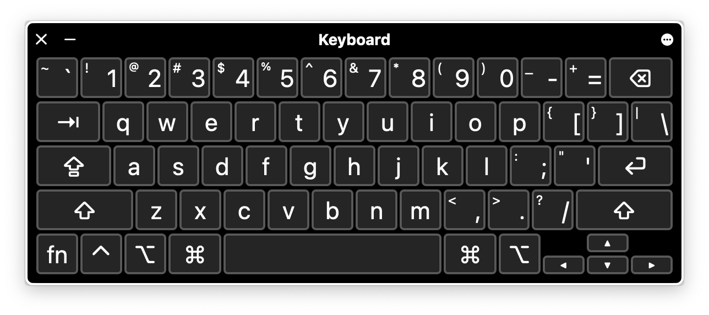
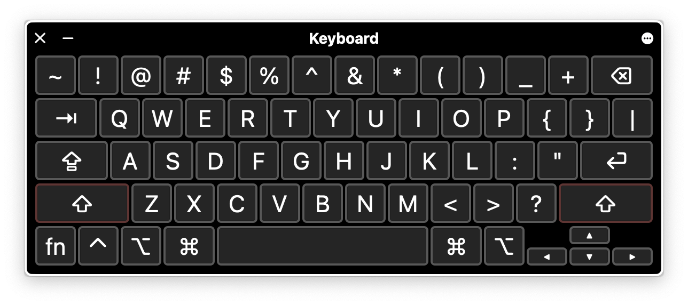
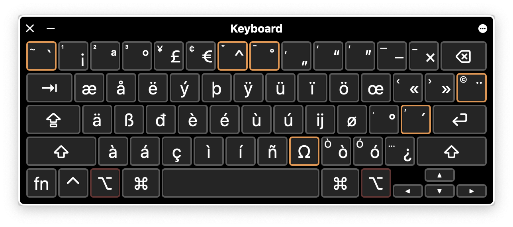
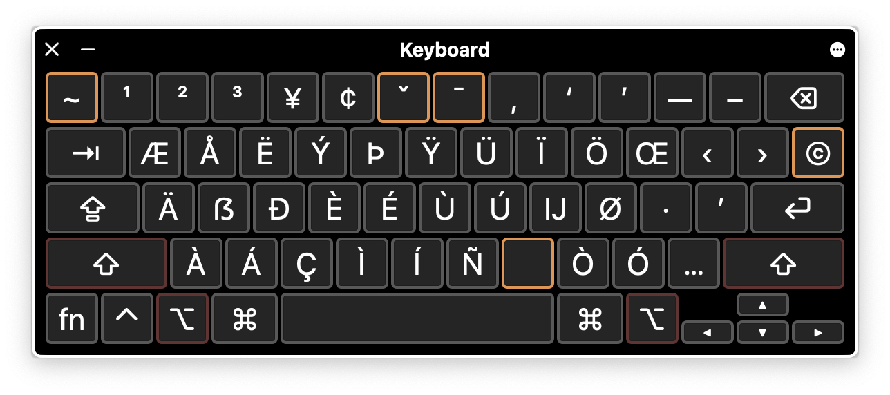

# EurKEY Typography Mod

### What’s different from EurKEY v1.2?

This is a modified EurKEY-Mac layout, optimized for typesetting and everyday typography needs:

- Replaced the division sign `÷` with minus `−` (`U+2212`).
- Moved the typesetter’s apostrophe `’` to the sad apostrophe `'` key, losing the diaeresis `¨` dead key.
- Replaced `¬` with the diaeresis `¨` dead key.
- Moved en dash `–` and em `—` dash to hyphen key (losing access to the `©` dead key and `№`).
- Removed broken bar `¦` and replaced it with the `©` dead key.
- Replaced section sign `§` with uppercase eszett `ẞ` (so that it can be accessed with ⌥⇧`s`). Sorry, lawyers.

I am releasing the *T* icon under [CC0](https://creativecommons.org/public-domain/cc0/). It seems impossible to make a keyboard layout icon that adapts to dark and light mode automatically, so I made one that works okay for both.

Thanks to Steffen Brüntjen for making EurKEY.

Thanks to Jonas Diemer and Leonardo Brondani Schenkel for the macOS port.

# EurKEY-Mac

The Keyboard Layout for Europeans, Coders and Translators – Version for Mac OS X.

This is a port of the [EurKEY Keyboard layout](http://eurkey.steffen.bruentjen.eu/), which features a QWERTY baseline layout (=good access to braces etc.) with quick access to commonly used accented characters and Umlauts.

**Status**: The whole layout should be mapped now. Please report if you find any missing characters.

## Install

Copy the two files `EurKEY-Typography.keylayout` and `EurKEY-Typography.icns` to your library, either system-wide (`/Library/Keyboard Layouts`) or for your local user (`~/Library/Keyboard Layouts`). A system-wide installation is preferred though to ensure the layout is available to all applications. (See also [this Superuser answer](https://superuser.com/a/561613/263461).)

## License

The EurKEY layout is licensed under [GPLv3](http://www.gnu.org/licenses/gpl-3.0.html).
